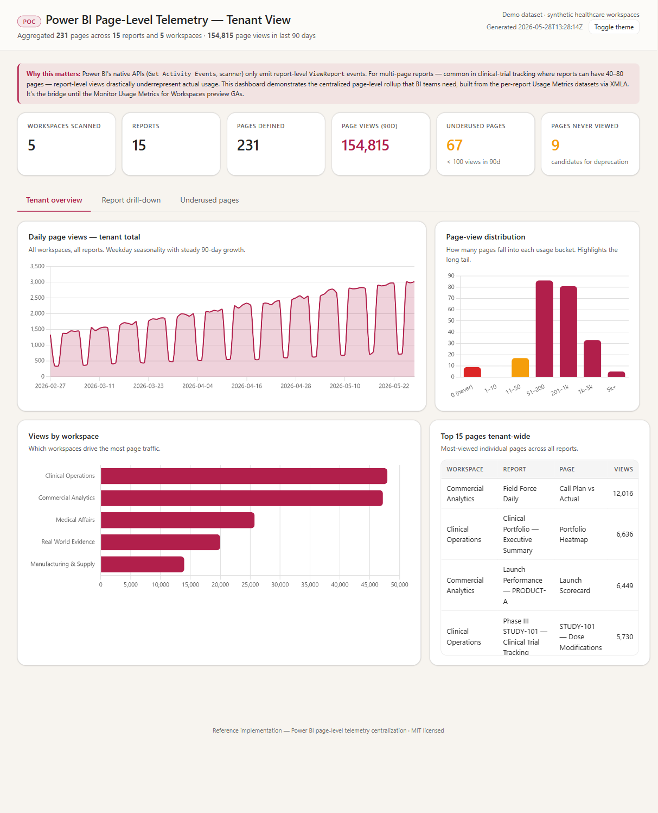
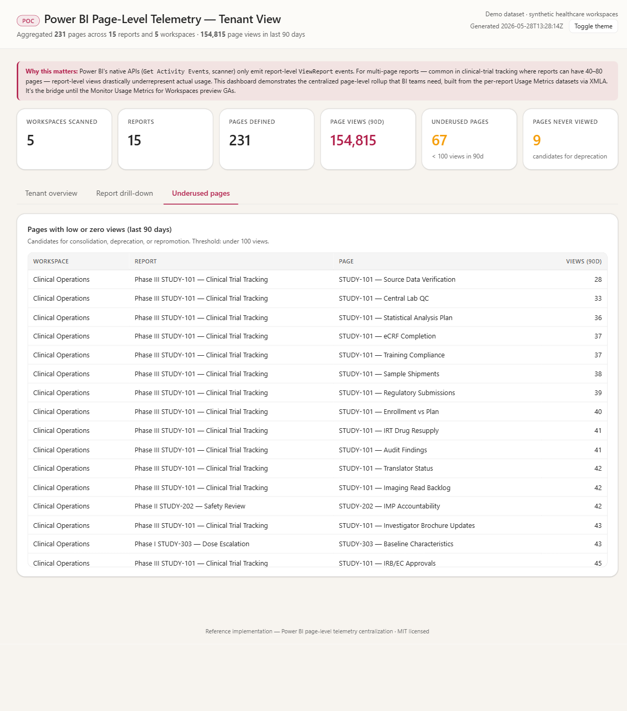
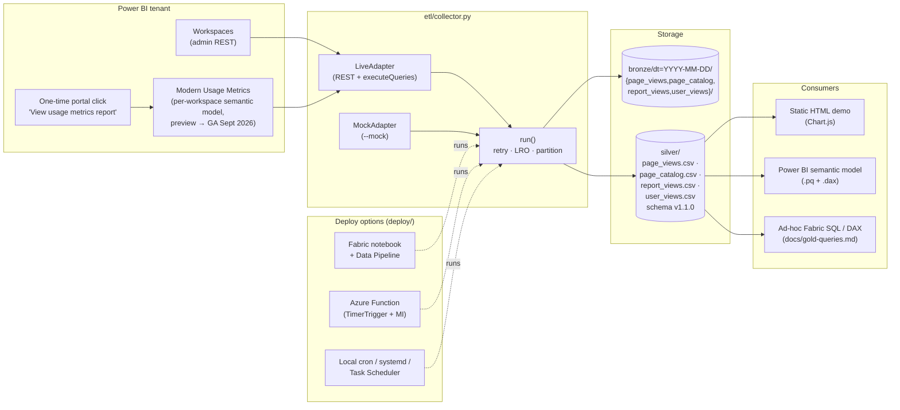
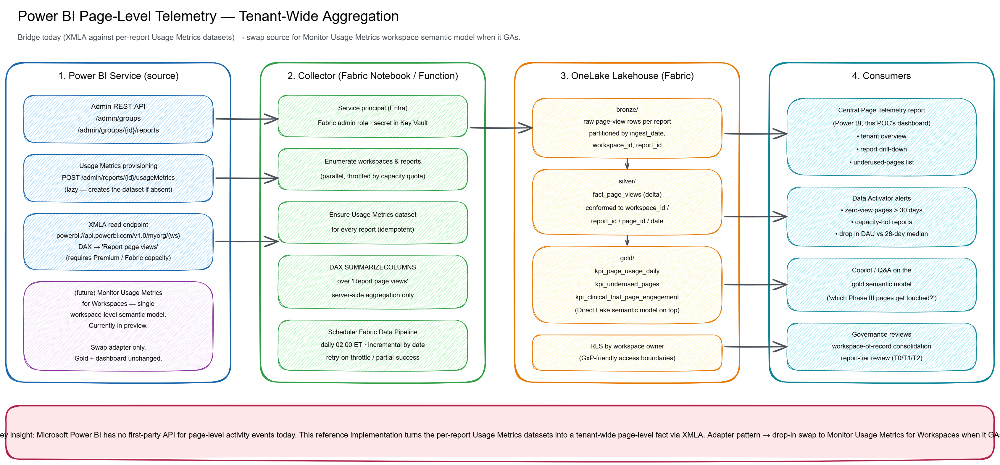

# Power BI Page-Level Telemetry — Reference Implementation

> **Tenant-wide, programmatic, page-level usage analytics for Power BI —
> without waiting for a first-party API.**

[](LICENSE)
[](https://www.python.org/)
[](https://learn.microsoft.com/power-bi/)
[](https://learn.microsoft.com/fabric/)

## The problem

Power BI's admin telemetry stops at the **report** grain. The
`Get Activity Events` REST API, the Admin scanner, and the audit log all
emit `ViewReport` events with no `Page` or `Section` field. Page-level
data *does* exist, but only inside the
**Monitor Usage Metrics for Workspaces (preview)** semantic model that
Power BI auto-provisions per workspace on the first portal click of
`... → View usage metrics report`. There is no public REST to provision
or query that model in bulk — confirmed by Power BI PM **David Browne**
in the May 2026 HLS Roundtable:

> *"We don't have an API, but [Monitor Usage Metrics for Workspaces]
> builds a semantic model you can access."*

For BI teams running thousands of reports — especially long
multi-page reports (clinical trial trackers, ops scorecards, finance
packs) — this means:

- ❌ No way to see **which pages** are actually used across the tenant
- ❌ No way to find **never-viewed pages** sitting in production reports
  (a 60-page clinical-trial report can have 5-10 dead pages nobody opens)
- ❌ No way to combine **page**, **report**, and **user** grains into a
  single store you can ad-hoc-query without re-running per report
- ❌ No way to feed page-level signals into a central monitoring report,
      Data Activator alert, or governance workflow
- ❌ Report-level view counts dramatically understate effort lost on
      pages no one opens

## What this repo gives you

A small, opinionated reference implementation that **closes the gap
today** using only documented Microsoft APIs:

1. **`etl/collector.py`** — a Python collector that:
   - Enumerates every workspace and report via the **Power BI Admin
     REST API**.
   - For each workspace, looks up the **Modern Usage Metrics**
     semantic model (auto-provisioned by Power BI on the first
     portal click of `... → View usage metrics report`). Workspaces
     that have never been bootstrapped are recorded in the run
     summary so an admin can do the one-time click in bulk.
   - Queries each per-workspace Usage Metrics model via the Power BI
     REST `executeQueries` endpoint with a parameterised DAX
     `CALCULATETABLE(SUMMARIZECOLUMNS(...))` (server-side aggregation,
     pushed-down filters, only summary rows transit the wire).
   - Calls `GET /v1.0/myorg/groups/{ws}/reports/{rep}/pages` (a GA,
     non-preview REST endpoint) to land a **page catalog** — every
     page that exists in every report, including pages with zero
     views. A LEFT JOIN against `page_views` gives you the
     **unused-page list** Jon at Incyte asked for.
   - Pulls **4 grains** into 4 silver CSVs (v0.3.0):
     `page_views` (page-day), `page_catalog` (every page that exists),
     `report_views` (report-day), `user_views` (per-hashed-user-day).
   - Lands rows in a `bronze/` → `silver/` layout that drops cleanly into
     a Fabric Lakehouse, ADLS Gen2, or local disk.
   - Ships with a `MockAdapter` so you can run the whole pipeline on a
     laptop with no tenant access. The mock data deliberately includes
     **10 unused pages** across 3 clinical-trial reports so the
     unused-page flow is demonstrable end-to-end.

2. **`dashboard/PageUsageDashboard.html`** — a self-contained HTML
   dashboard (Chart.js, no build step, no server) that demonstrates the
   three views you'll want from this data:
   - **Tenant overview** — daily trend, workspace breakdown, page-view
     distribution showing how long the tail really is, top-15 pages.
   - **Report drill-down** — every page ranked, with hatched bars for
     pages that have **never been viewed**.
   - **Underused pages** — every page tenant-wide with < 100 views in
     90 days, sorted ascending. The work list.

   

   

3. **`docs/deployment-guide.md`** + **`docs/api-reference.md`** —
   everything you need to stand the collector up in your tenant:
   service principal setup, capacity requirements, the exact REST
   endpoints, the exact DAX query, throttling guidance, and an RBAC
   matrix.

4. **`architecture.png`** — a one-glance architecture diagram (sources
   → collector → lakehouse → consumers).

## Architecture at a glance



The PNG below is the full-fidelity version of the same diagram for
README readers whose Markdown viewer doesn't render Mermaid.



## Quick start

```bash
# 1. Open the dashboard. No setup required.
#    Windows:
start dashboard\PageUsageDashboard.html
#    macOS:
open dashboard/PageUsageDashboard.html
#    Linux:
xdg-open dashboard/PageUsageDashboard.html

# 2. Run the collector end-to-end in mock mode (no tenant access).
cd etl
pip install -r requirements.txt
python collector.py --mock
# → writes out/bronze/dt=YYYY-MM-DD/*.csv, out/silver/page_views.csv,
#   out/_run_summary.json

# 3. (Optional) Regenerate the synthetic sample data.
python generate_sample_data.py                  # default (healthcare)
python generate_sample_data.py --theme generic  # SaaS / line-of-business
python generate_sample_data.py --theme financial
python aggregate_for_dashboard.py
cd ../dashboard
python bundle.py

# 4. (Optional) Emit an ops-friendly one-line summary for App Insights /
#    Prometheus scrapers.
python collector.py --mock --metrics appinsights
python collector.py --mock --metrics prometheus
```

> Requires **Python 3.10+** (the collector uses PEP 604 `X | None` type hints).
> `requests` is the only runtime dependency; `pyadomd` is only needed for true
> XMLA queries in live mode (see `docs/deployment-guide.md`).

### One-time workspace bootstrap (live mode only — does not affect mock)

The first time you use Modern Usage Metrics in a workspace, a workspace
admin or contributor must click **once** in the Power BI portal to ask
Power BI to provision the per-workspace semantic model:

1. Open any report in the workspace
2. Click `...` in the report header → **View usage metrics report**
3. Close the resulting tab — you only needed to provision the model

After that, Power BI accumulates page-level data for **every** report
in the workspace into a single `Usage Metrics Report` semantic model,
refreshed daily by Microsoft. The collector reads it with one
`executeQueries` call per report.

Workspaces that haven't been bootstrapped are skipped at runtime and
listed in `_run_summary.json` → `workspaces_not_bootstrapped`, so an
admin can batch-bootstrap and re-run.

To run against a real tenant, see [`docs/deployment-guide.md`](docs/deployment-guide.md).

## Deployment options

For production, pick one of three ready-to-deploy wrappers in [`deploy/`](deploy/):

| Option | When to use | Folder |
| --- | --- | --- |
| **A — Fabric notebook + Data Pipeline** | Fabric-first shop; you want data in the same Lakehouse | [`deploy/fabric-notebook/`](deploy/fabric-notebook/) |
| **B — Azure Function (TimerTrigger)** | Outside Fabric; you want Managed Identity / Key Vault | [`deploy/azure-function/`](deploy/azure-function/) |
| **C — Local / scheduled job** | POC / demo / single BI ops box (Task Scheduler / cron / systemd) | [`deploy/local/`](deploy/local/) |

Each folder ships a self-contained README with step-by-step setup,
provisioning commands, and a troubleshooting table — see
[`deploy/README.md`](deploy/README.md) for the picker.

## Repo layout

```
.
├── README.md                            ← this file
├── LICENSE                              ← MIT
├── architecture.excalidraw              ← editable architecture diagram
├── architecture.png                     ← exported PNG
├── dashboard/
│   ├── PageUsageDashboard.html          ← self-contained demo dashboard
│   ├── _template.html                   ← Chart.js + Clawpilot theme template
│   ├── bundle.py                        ← inlines page_views.json into template
│   ├── page_views.json                  ← aggregated payload the dashboard reads
│   └── PowerBI/                         ← Power Query M + DAX measures for a real Power BI report
├── etl/
│   ├── collector.py                     ← the collector (mock + live modes, retry, LRO, --metrics)
│   ├── generate_sample_data.py          ← synthetic-data generator (--theme healthcare|generic|financial)
│   ├── aggregate_for_dashboard.py       ← rolls silver CSV → dashboard JSON
│   ├── requirements.txt
│   └── sample_data/
│       ├── page_views.csv               ← 15k+ rows · 5 workspaces · 15 reports · 90 days
│       └── reports_catalog.csv          ← every defined page (incl. never-viewed)
├── deploy/                              ← ready-to-deploy wrappers (pick one)
│   ├── README.md                        ←   options index
│   ├── fabric-notebook/                 ←   Option A: Fabric notebook + Data Pipeline JSON
│   ├── azure-function/                  ←   Option B: Azure Functions v2 (TimerTrigger + MI)
│   └── local/                           ←   Option C: PS1 / bash / systemd / Task Scheduler
├── tests/                               ← pytest suite (mock reproducibility, retry logic, artifacts)
├── .github/workflows/ci.yml             ← Python 3.10/3.11/3.12 × Ubuntu/Windows
└── docs/
    ├── deployment-guide.md              ← stand it up in your tenant
    ├── api-reference.md                 ← REST endpoints, DAX, RBAC, throttling
    ├── data-dictionary.md               ← silver schema column-by-column
    ├── pii-and-retention.md             ← PII, RLS, DSAR, 90-day retention
    ├── design.md                        ← why this design (and what we rejected)
    ├── runbook.md                       ← on-call response for failed runs
    └── gold-queries.md                  ← DAX / SQL cookbook for the questions customers ask
```

## Documentation

| Audience | Read first |
|---|---|
| **Customer evaluating** | [Quick start](#quick-start) → [`deploy/README.md`](deploy/README.md) |
| **Customer deploying** | [`docs/deployment-guide.md`](docs/deployment-guide.md) → [`docs/api-reference.md`](docs/api-reference.md) → [`deploy/<option>/README.md`](deploy/) |
| **Customer operating** | [`docs/runbook.md`](docs/runbook.md) → [`docs/data-dictionary.md`](docs/data-dictionary.md) → [`docs/pii-and-retention.md`](docs/pii-and-retention.md) |
| **Customer extending** | [`docs/design.md`](docs/design.md) → [`CONTRIBUTING.md`](CONTRIBUTING.md) → [`tests/`](tests/) |
| **Customer analyzing** | [`docs/gold-queries.md`](docs/gold-queries.md) → [`dashboard/PowerBI/`](dashboard/PowerBI/) |
| **Security review** | [`SECURITY.md`](SECURITY.md) → [`docs/pii-and-retention.md`](docs/pii-and-retention.md) → [`NOTICE.md`](NOTICE.md) |

## Architecture


Four columns, left to right:

1. **Sources** — Power BI Admin REST API (workspace & report enumeration),
   Usage Metrics v2 datasets (per-report, auto-generated by Power BI).
2. **Collector** — service principal auth, REST enumeration, idempotent
   `POST /usageMetrics`, XMLA DAX query, bronze CSV/Parquet per report.
3. **Lakehouse** — bronze (raw per-report) → silver (conformed fact) →
   gold (KPI marts) in OneLake / ADLS Gen2 / local disk.
4. **Consumers** — central Power BI report (DirectLake on gold), Data
   Activator alerts, Copilot Q&A, governance workflows.

The **adapter pattern** in `collector.py` (`CollectorAdapter` → `LiveAdapter`
or `MockAdapter`) is deliberate: when Microsoft's
**Monitor Usage Metrics for Workspaces** capability GAs (one
workspace-level semantic model that includes page activity), swap in a
`WorkspaceSemanticModelAdapter` and nothing downstream changes.

## The sample data

The bundled `sample_data/page_views.csv` is fully synthetic and
deterministic (seeded RNG). It simulates a healthcare BI tenant
because that's a domain where multi-page reports are common and the
long-tail problem is dramatic — but the collector itself is
industry-agnostic and will work against any Power BI tenant.

What's in the sample:

- **5 workspaces**: Clinical Operations, Medical Affairs, Real World
  Evidence, Commercial Analytics, Manufacturing & Supply.
- **15 reports** ranging from a 6-page daily ops dashboard to a
  **60-page Phase III clinical trial report** (STUDY-101).
- **90 days** of daily page-view rows with realistic seasonality
  (weekday peaks), Zipf-distributed page popularity.
- **10 intentionally-unused pages** across the 3 clinical-trial
  reports (`unused_pages.json` overlay), with names like
  "Protocol v1 (legacy)", "DEBUG: per-site raw rates",
  "Enrollment funnel (deprecated)" — these show up in
  `page_catalog.csv` but have ZERO rows in `page_views.csv`, which
  is exactly the waste signal page-level telemetry exists to surface.
- **9 additional under-9-view pages** in long reports
  (the legacy v0.2.x "never-viewed in 90d" signal).

When you run `dashboard/PageUsageDashboard.html`, the headline numbers
you'll see are:

| Metric | Value |
| --- | --- |
| Workspaces | 5 |
| Reports | 15 |
| Distinct pages defined (catalog) | 232 |
| Distinct pages viewed | 221 |
| Total page views | 154,815 |
| **Pages defined but never viewed in 90 days** | **10** |
| **Reports with at least one unused page** | **3** |
| **Underused pages (1–99 views in 90 days)** | **67** |
| Report-level rows (90 days × 15 reports) | 1,350 |
| User-level rows (hashed UPN) | 6,289 |

These numbers are reproducible — the data generator is fully deterministic
(CRC32-seeded RNG), so `python generate_sample_data.py` will always
produce the same `page_views.csv`.

## Why an adapter pattern, not just one script?

Three reasons:

1. **The collector should not change when Microsoft ships the new API.**
   When Monitor Usage Metrics for Workspaces GAs, the bronze rows that
   land on disk should be identical so the silver/gold/dashboard layer
   never knows the data source changed.
2. **Customers want to run the dashboard before they install anything.**
   The `MockAdapter` exists so a 30-minute demo is possible without any
   tenant access, service principal, or capacity.
3. **Other data sources need the same shape.** Several teams have asked
   about layering Microsoft Sentinel audit-log signals or third-party
   web-analytics events on top of the same gold model. With the adapter
   pattern, that's a new class file, not a fork of the whole project.

## What about the Microsoft GA path?

The Modern Usage Metrics for Workspaces feature this collector reads
is in **public preview** today (May 2026) and is targeting
**GA September 2026** per Rui Romano (Power BI PM). At GA:

- The per-workspace semantic model and its page-level schema should
  stabilise. The collector's `PBI_USAGE_DATASET_NAME` /
  `DAX_PAGE_VIEWS_TEMPLATE` knobs absorb minor schema rename
  without code changes.
- The one-time `... → View usage metrics report` portal bootstrap may
  become a tenant-wide toggle, removing the per-workspace click. Watch
  the Power BI release notes.
- Microsoft may eventually ship a public REST that does the same
  enumeration + DAX execution this collector does. When that happens
  this repo becomes a reference implementation of the same pattern,
  not the only way to do it.

This repo is the **bridge today** that becomes a **first-class consumer
of the GA shape**: silver / gold schemas, the dashboard, and the
Power BI template don't change — only the source adapter.

## Troubleshooting

Common gotchas and their fixes are in
[`docs/deployment-guide.md#9-troubleshooting`](docs/deployment-guide.md#9-troubleshooting):

- Garbled em-dashes in console output (Windows PowerShell 5.x / legacy `cmd.exe`)
- `AADSTS700016` / `AADSTS7000215` authentication errors
- Live mode runs but writes zero rows (XMLA endpoint / SP permissions)
- `PermissionError` writing to `out/` on a network drive

Setting `PBI_DEBUG=1` makes the collector emit full Python stack traces
instead of a one-line error summary.

## Contributing

Issues and PRs welcome. Likely high-value additions:

- A `WorkspaceSemanticModelAdapter` once Microsoft's new preview stabilises.
- A T-SQL / Spark notebook that lands the silver layer in a Lakehouse
  Delta table.
- An optional `kusto` adapter for tenants that already pipe audit logs
  into Microsoft Sentinel / ADX.

## License

[MIT](LICENSE). Use, fork, sell, modify — just don't blame the authors.
